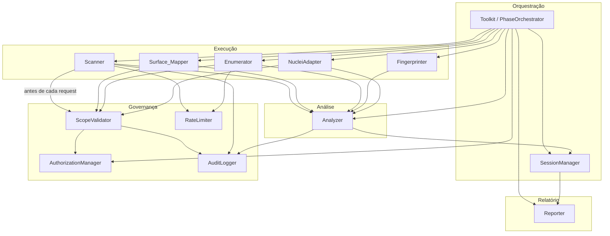
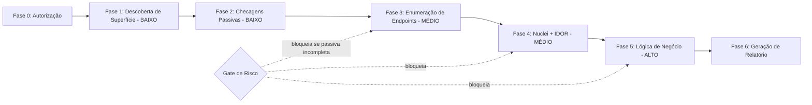
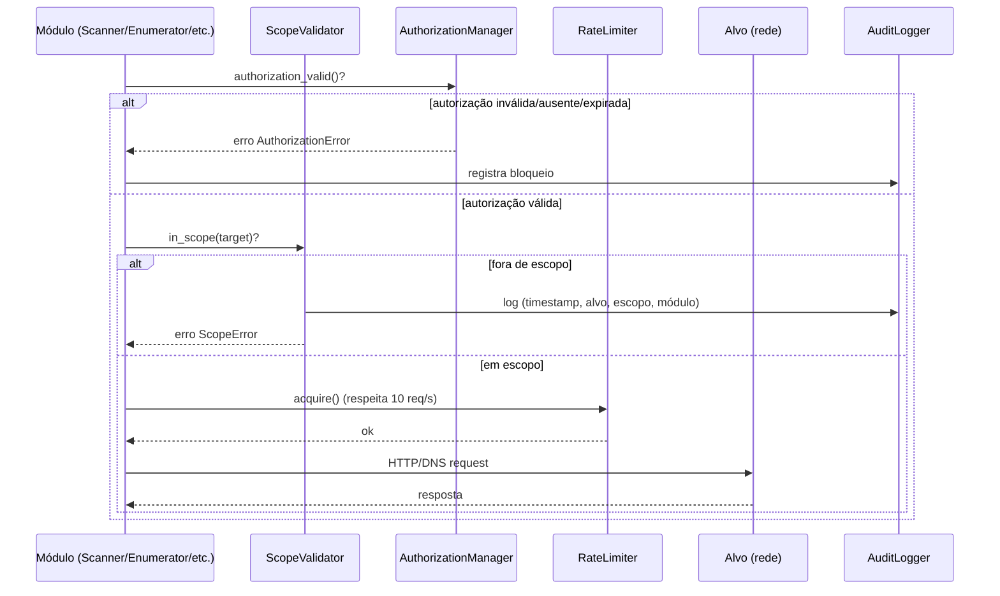

# Documento de Design — Web Security Audit Toolkit

## Overview

> Visão Geral

O **Web Security Audit Toolkit** é um framework de auditoria de segurança de aplicações web, implementado em **Python**, destinado a uso acadêmico mediante autorização por escrito. O design materializa os 12 requisitos aprovados em uma arquitetura em camadas que separa claramente as responsabilidades de **orquestração** (Toolkit), **execução de checagens** (Scanner e seus auxiliares de descoberta), **interpretação de resultados** (Analyzer) e **geração de relatório** (Reporter).

O princípio condutor do design é a **segurança e a ética operacional**: nenhuma requisição de rede é despachada sem que a autorização tenha sido validada e o alvo confirmado dentro do escopo autorizado. As ações são **não-destrutivas**, respeitam **rate limiting** (máximo de 10 req/s) e seguem uma ordem de risco crescente (passivo → ativo → lógica de negócio), com *gating* explícito entre fases.

O fluxo de auditoria é **iterativo e de 7 fases**, com estado persistente em JSON, permitindo que o Auditor pause, retome e traga resultados de cada fase para análise contextualizada. Cada achado (Finding) é padronizado com resumo, confiança, severidade, evidência, próximos passos e orientação de correção, e o relatório final é gerado em **Markdown** e **HTML auto-contido**.

### Decisões de Design Principais

| Decisão | Justificativa |
|---------|---------------|
| Python como linguagem de implementação | Solicitado pelo usuário; ecossistema rico para HTTP (`requests`/`httpx`), DNS (`dnspython`), regex e parsing JSON; fácil integração via `subprocess` com Nuclei. |
| Arquitetura em camadas com componentes nomeados | Espelha o glossário dos requisitos (Scanner, Analyzer, Reporter, Surface_Mapper, Enumerator, Fingerprinter), facilitando rastreabilidade requisito→código. |
| Validação de escopo centralizada (ScopeValidator) | A regra "validar antes de despachar qualquer requisição" (Req. 1.4) é transversal; centralizá-la evita que um módulo esqueça de aplicá-la. |
| Estado de sessão em JSON único | Atende Req. 12.3/12.4 (persistência e retomada) com formato legível e versionável, sem dependência de banco de dados. |
| Integração com Nuclei via `subprocess` + parsing JSONL | Nuclei é uma ferramenta CLI madura; reaproveitar sua base de templates é mais eficiente que reimplementar checagens (Req. 10). |
| Findings como dataclasses serializáveis | Permite round-trip determinístico (Req. 10.5) e ordenação/serialização consistentes para o relatório. |

## Architecture

> Arquitetura

A arquitetura é organizada em cinco camadas. A camada de **Orquestração** controla o fluxo de fases e o *gating* de risco; a camada de **Governança** garante autorização e escopo antes de qualquer ação; a camada de **Execução** realiza as checagens; a camada de **Análise** interpreta e classifica; e a camada de **Relatório** consolida os achados.



### Mapeamento das 7 Fases

O orquestrador conduz a auditoria em sete fases, com risco crescente e *gating* (Req. 12.5/12.6):



| Fase | Nível de Risco | Componentes | Requisitos |
|------|----------------|-------------|------------|
| 0. Autorização | — | AuthorizationManager | 1 |
| 1. Descoberta de Superfície | BAIXO | Surface_Mapper, Enumerator, Fingerprinter | 2 |
| 2. Checagens Passivas | BAIXO | Scanner (source maps, segredos, CDN bypass passivo, headers) | 4, 5, 6, 7 |
| 3. Enumeração de Endpoints | MÉDIO | Enumerator | 3 |
| 4. Nuclei + IDOR | MÉDIO | NucleiAdapter, Scanner | 8, 10 |
| 5. Lógica de Negócio | ALTO | Scanner | 9 |
| 6. Relatório | — | Reporter | 11 |

O *gating* é implementado pelo `PhaseOrchestrator`: ao solicitar uma fase de risco MÉDIO ou ALTO, ele verifica no `SessionState` se a fase de descoberta passiva (Fase 1) foi concluída. Se não, exibe aviso e exige confirmação explícita (Req. 12.6).

### Fluxo de uma Requisição de Rede

Toda requisição de rede passa por um *gateway* comum que garante autorização, escopo e rate limiting. Isso centraliza as garantias de Req. 1.2, 1.4 e 3.7.



## Components and Interfaces

> Componentes e Interfaces

Os componentes são apresentados como classes Python com suas interfaces públicas. As assinaturas usam *type hints* e dataclasses descritas na seção Modelos de Dados.

### Toolkit / PhaseOrchestrator

Ponto de entrada e orquestrador do fluxo iterativo. Não executa rede diretamente; delega aos componentes de execução após validar pré-condições.

```python
class PhaseOrchestrator:
    def start_session(self, working_dir: str) -> SessionState: ...
    def resume_session(self, working_dir: str) -> SessionState: ...
    def describe_phase(self, phase: Phase) -> PhaseBriefing: ...
        # Retorna objetivo, comandos exatos e instruções de coleta (Req. 12.1)
    def can_enter_phase(self, phase: Phase, state: SessionState) -> GateResult: ...
        # Aplica gating de risco (Req. 12.5/12.6)
    def ingest_phase_results(self, phase: Phase, raw_results: dict) -> PhaseAnalysis: ...
        # Delega ao Analyzer e atualiza o estado (Req. 12.2)
```

### AuthorizationManager

Gerencia o ciclo de vida da autorização (Req. 1).

```python
class AuthorizationManager:
    def register(self, domain: str, institution: str, auth_date: date,
                 scopes: list[str], cidrs: list[str]) -> Authorization: ...
        # Exige os 3 campos obrigatórios; persiste em arquivo de config (Req. 1.1, 1.3)
    def load(self, working_dir: str) -> Authorization | None: ...
    def is_valid(self, auth: Authorization, now: date) -> bool: ...
        # Válida se 3 campos presentes e auth_date <= 1 ano antes de now (Req. 1.2)
    def is_expired(self, auth: Authorization, now: date) -> bool: ...
        # True se now - auth_date > 1 ano (Req. 1.6)
    def require_valid(self, auth: Authorization | None, now: date) -> None: ...
        # Lança AuthorizationError se inválida/ausente (Req. 1.2)
```

### ScopeValidator

Decide, de forma pura, se um alvo está dentro do escopo autorizado. Usado antes de cada requisição (Req. 1.4, 1.5, 2.6).

```python
class ScopeValidator:
    def __init__(self, authorized_domains: list[str], authorized_cidrs: list[str]): ...
    def in_scope(self, target: str) -> bool: ...
        # Match exato de domínio OU sufixo de subdomínio OU IP dentro de CIDR
    def assert_in_scope(self, target: str, module: str, logger: AuditLogger) -> None: ...
        # Lança ScopeError e registra evento se fora de escopo (Req. 1.5)
```

### RateLimiter

Garante a taxa máxima de requisições (Req. 3.6, 3.7). Implementa *token bucket* com taxa configurável (1–10 req/s) e *backoff* sob HTTP 429.

```python
class RateLimiter:
    def __init__(self, max_rps: int = 10): ...   # configurável 1..10 (Req. 3.7)
    def acquire(self) -> None: ...               # bloqueia até haver token
    def apply_backoff(self, delay_s: float) -> None: ...  # 1..60s, default 5s (Req. 3.6)
```

### Surface_Mapper

Conduz a descoberta de superfície de ataque (Req. 2).

```python
class SurfaceMapper:
    def enumerate_subdomains(self, domain: str) -> list[str]: ...
        # Passivo: DNS + Certificate Transparency (Req. 2.1)
    def identify_active_hosts(self, subdomains: list[str]) -> list[Host]: ...
        # Ativo se responde a TCP SYN/ICMP em até 5s (Req. 2.2)
    def build_surface_map(self, hosts: list[Host], ports: dict, techs: dict,
                          scope: ScopeValidator, logger: AuditLogger) -> AttackSurfaceMap: ...
        # Exclui itens fora de escopo, registrando a exclusão (Req. 2.5, 2.6)
```

### Enumerator

Enumeração de portas, diretórios, arquivos e parâmetros (Req. 2.3, 3).

```python
class Enumerator:
    def scan_ports(self, host: Host) -> list[int]: ...
        # Portas fixas: 80,443,8080,8443,8000,8888,9090,9443,3000,5000 (Req. 2.3)
    def discover_paths(self, base_url: str, wordlist: list[str]) -> list[Endpoint]: ...
        # Wordlist >=100 entradas + painéis administrativos comuns (Req. 3.1, 3.2)
    def classify_response(self, path: str, resp: HttpResponse) -> Endpoint: ...
        # Registra 200 (status, tamanho, title) e 301/302 (path, status, Location) (Req. 3.3, 3.4)
    def probe_parameters(self, endpoint: Endpoint) -> list[str]: ...
        # Varia um parâmetro por vez, registra campos de saída (Req. 3.5)
```

### Fingerprinter

Identifica tecnologias e versões dos serviços ativos (Req. 2.4).

```python
class Fingerprinter:
    def fingerprint(self, host: Host, open_ports: list[int]) -> list[Technology]: ...
        # Identifica web server, framework e CDN
```

### Scanner

Executa as checagens de vulnerabilidade específicas. Cada método retorna dados brutos/estruturados a serem interpretados pelo Analyzer.

```python
class Scanner:
    def check_source_maps(self, base_url: str) -> SourceMapResult: ...
        # Busca HTML, extrai URLs de assets, testa >=10 paths .map (Req. 4.1)
    def analyze_js_bundle(self, base_url: str) -> list[BundleHit]: ...
        # Baixa bundles .js, pula falhas e continua (Req. 5.1)
    def check_cdn_bypass(self, domain: str) -> CdnBypassResult: ...
        # Candidatos passivos (<=5), request direta com Host header, timeout 10s (Req. 6.1, 6.2)
    def check_security_headers(self, domain: str) -> HeadersResult: ...
        # GET com timeout 10s, extrai todos os headers (Req. 7.1)
    def check_idor(self, endpoint: str, auth_token: str) -> list[IdorProbe]: ...
        # Gera <=5 variações de identificador, requests autenticados (Req. 8.1, 8.6)
    def check_business_logic(self, endpoints: BizEndpoints,
                             enable_race: bool = False) -> BizLogicResult: ...
        # Manipula parâmetros; race = 3 requests simultâneos (Req. 9.1, 9.3)
```

### NucleiAdapter

Integra a ferramenta externa Nuclei via `subprocess` (Req. 10).

```python
class NucleiAdapter:
    def is_available(self) -> bool: ...
        # Verifica binário no PATH; senão, instruções por SO (Req. 10.1)
    def run(self, target: str, tags: list[str]) -> NucleiRun: ...
        # Executa com tags + saída JSON; captura stdout/stderr/exit_code (Req. 10.2, 10.6)
    def parse_output(self, jsonl_text: str) -> list[NucleiFinding]: ...
        # Parseia JSONL linha a linha (Req. 10.3)
    def serialize(self, findings: list[NucleiFinding]) -> str: ...
        # Re-serializa para JSONL (suporta round-trip — Req. 10.5)
    def deduplicate(self, findings: list[NucleiFinding]) -> list[NucleiFinding]: ...
        # Remove duplicatas por (template_id, host), mantém a primeira (Req. 10.4)
```

### Analyzer

Interpreta resultados brutos, classifica achados (severidade/confiança) e mapeia para o formato padrão de Finding (Req. 4–10, 12.2).

```python
class Analyzer:
    def analyze_source_maps(self, result: SourceMapResult) -> list[Finding]: ...
    def analyze_bundle_hits(self, hits: list[BundleHit]) -> list[Finding]: ...
    def analyze_cdn_bypass(self, result: CdnBypassResult) -> list[Finding]: ...
    def analyze_headers(self, result: HeadersResult) -> list[Finding]: ...
    def analyze_idor(self, probes: list[IdorProbe], auth_user_id: str) -> list[Finding]: ...
    def analyze_business_logic(self, result: BizLogicResult) -> list[Finding]: ...
    def map_nuclei_findings(self, findings: list[NucleiFinding]) -> list[Finding]: ...
    def summarize_phase(self, findings: list[Finding]) -> PhaseAnalysis: ...
        # Resumo, confiança, severidade estimada, próximos passos, comandos (Req. 12.2)
```

### Reporter

Consolida os achados em relatório técnico (Req. 11).

```python
class Reporter:
    def order_findings(self, findings: list[Finding]) -> list[Finding]: ...
        # Severidade desc, depois confiança desc (Req. 11.5)
    def top_next_steps(self, findings: list[Finding], k: int = 3) -> list[Finding]: ...
        # Top 3 por severidade + facilidade de correção (Req. 11.6)
    def render_markdown(self, session: SessionState) -> str: ...
    def render_html(self, session: SessionState) -> str: ...
        # HTML auto-contido com CSS inline (Req. 11.4)
    def generate(self, session: SessionState, out_dir: str) -> ReportArtifacts: ...
        # Gera .md e .html; trata sessão sem findings (Req. 11.1, 11.7)
```

### SessionManager / AuditLogger

```python
class SessionManager:
    def save(self, state: SessionState, working_dir: str) -> None: ...   # JSON (Req. 12.3)
    def load(self, working_dir: str) -> SessionState: ...                # (Req. 12.4)

class AuditLogger:
    def log(self, event: AuditEvent) -> None: ...
        # Append-only com timestamp ISO 8601 (Req. 1.5, 2.6, 9.6)
```

## Data Models

> Modelos de Dados

Os modelos são `@dataclass` Python, serializáveis de/para JSON. Campos com valores sensíveis são mascarados na serialização de evidências.

### Authorization

```python
@dataclass
class Authorization:
    domain: str                  # domínio autorizado principal (Req. 1.1)
    institution: str             # nome da instituição (Req. 1.1)
    auth_date: date              # data da autorização por escrito (Req. 1.1)
    authorized_domains: list[str]  # lista para match de escopo (Req. 1.4)
    authorized_cidrs: list[str]    # faixas CIDR autorizadas (Req. 1.4)
    # válida se os 3 campos obrigatórios presentes e auth_date <= 1 ano (Req. 1.2)
```

### Target

```python
@dataclass
class Target:
    raw: str                     # entrada do auditor (domínio, host ou IP)
    kind: Literal["domain", "host", "ip"]
    resolved_ips: list[str] = field(default_factory=list)
```

### Host

```python
@dataclass
class Host:
    hostname: str
    ip: str
    is_active: bool              # respondeu a SYN/ICMP em 5s (Req. 2.2)
    open_ports: list[int] = field(default_factory=list)
    technologies: list["Technology"] = field(default_factory=list)
```

### Technology

```python
@dataclass
class Technology:
    name: str
    version: str | None
    category: Literal["web_server", "framework", "cdn", "other"]  # (Req. 2.4)
```

### Finding

Formato padronizado de achado, comum a todas as checagens (Req. 11.3).

```python
@dataclass
class Finding:
    id: str                      # identificador estável (ex.: SRCMAP-001)
    title: str
    summary: str                 # resumo (Req. 12.2)
    severity: Literal["low", "medium", "high", "critical"]  # (Glossário)
    confidence: Literal["low", "medium", "high"]            # (Glossário)
    status: Literal["confirmed", "not_vulnerable", "inconclusive", "check_failed"]
    affected_endpoint: str | None
    evidence: str                # truncada/mascarada conforme a checagem
    impact: str
    remediation: str             # comandos/configs exatos (Req. 11.3)
    next_steps: list[str]        # (Req. 12.2)
    references: list[str] = field(default_factory=list)  # CWE/OWASP (Req. 11.3)
```

### NucleiFinding

Representação fiel de um achado bruto do Nuclei, preservando os campos relevantes para o round-trip (Req. 10.3, 10.5). Campos desconhecidos são preservados em `extra` para garantir equivalência na re-serialização.

```python
@dataclass
class NucleiFinding:
    template_id: str             # "template-id"
    host: str
    matched_at: str | None       # "matched-at"
    severity: str                # info.severity
    name: str | None             # info.name
    tags: list[str]              # info.tags
    info: dict                   # bloco info completo
    timestamp: str | None
    extra: dict = field(default_factory=dict)  # campos não modelados (preserva round-trip)
```

### AttackSurfaceMap

```python
@dataclass
class AttackSurfaceMap:
    subdomains: list[str]                 # (Req. 2.5)
    active_hosts: list[Host]              # hosts com IPs e portas (Req. 2.5)
    technologies_by_host: dict[str, list[Technology]]  # (Req. 2.5)
    excluded: list["Exclusion"] = field(default_factory=list)  # fora de escopo (Req. 2.6)
```

```python
@dataclass
class Exclusion:
    host: str
    reason: str
    timestamp: str               # ISO 8601 (Req. 2.6)
```

### SessionState

Estado persistente da sessão iterativa (Req. 12.3).

```python
@dataclass
class SessionState:
    authorization: Authorization
    working_dir: str
    completed_phases: list[str]                 # fases concluídas (Req. 12.3)
    findings: list[Finding]                     # achados acumulados (Req. 12.3)
    tested_targets: list[str]                   # alvos testados (Req. 12.3)
    surface_map: AttackSurfaceMap | None = None
    operations_log: list["OperationRecord"] = field(default_factory=list)  # timestamps ISO 8601
```

```python
@dataclass
class OperationRecord:
    phase: str
    action: str
    timestamp: str               # ISO 8601 (Req. 12.3)
```

### AuditEvent

```python
@dataclass
class AuditEvent:
    timestamp: str               # ISO 8601 (Req. 1.5, 9.6)
    event_type: Literal["scope_block", "exclusion", "biz_request", "error", "info"]
    target: str | None
    module: str | None
    detail: dict                 # payloads mascarados quando sensível (Req. 9.6)
```

## Correctness Properties

*Uma propriedade é uma característica ou comportamento que deve ser verdadeiro em todas as execuções válidas de um sistema — essencialmente, uma afirmação formal sobre o que o sistema deve fazer. Propriedades servem como a ponte entre especificações legíveis por humanos e garantias de correção verificáveis por máquina.*

As propriedades abaixo foram derivadas da análise de prework das acceptance criteria e consolidadas para eliminar redundância. Componentes puramente de UI, de infraestrutura externa (DNS, probing de rede, execução do binário Nuclei) e de configuração estática são cobertos por testes de exemplo, integração ou smoke (ver Estratégia de Testes), não por propriedades.

### Property 1: Validade e expiração da autorização

*Para toda* `Authorization` e qualquer data de referência `now`, `is_valid` retorna verdadeiro se e somente se os três campos obrigatórios (domínio, instituição, data) estão presentes E `auth_date` não é mais de 1 ano anterior a `now`; e `is_expired` é verdadeiro se e somente se `now - auth_date` excede 1 ano. Quando inválida ou ausente, `require_valid` sempre lança `AuthorizationError`.

**Validates: Requirements 1.2, 1.6**

### Property 2: Decisão de escopo e bloqueio com log

*Para toda* lista de domínios/CIDRs autorizados e qualquer alvo, `in_scope` retorna verdadeiro se e somente se o alvo é um domínio autorizado por correspondência exata, é um subdomínio sufixo de um domínio autorizado, ou é um IP contido em algum CIDR autorizado; e para qualquer alvo fora de escopo, `assert_in_scope` sempre lança `ScopeError` e registra um `AuditEvent` contendo timestamp, alvo, escopo autorizado e módulo solicitante.

**Validates: Requirements 1.4, 1.5**

### Property 3: Limitação de taxa e cálculo de delay

*Para toda* taxa configurada e qualquer número de aquisições, o `RateLimiter` limita (clamp) a taxa efetiva ao intervalo [1, 10] req/s e a taxa observada nunca ultrapassa o máximo; e *para todo* valor de configuração de delay sob HTTP 429, o delay aplicado está sempre no intervalo [1, 60] segundos (com padrão 5).

**Validates: Requirements 3.6, 3.7**

### Property 4: Geração do mapa de superfície exclui itens fora de escopo

*Para todo* conjunto de hosts (mistura de dentro e fora de escopo) com suas portas e tecnologias, o `AttackSurfaceMap` resultante contém exatamente os hosts em escopo da entrada com suas portas e tecnologias preservadas, não contém nenhum host fora de escopo, e registra uma `Exclusion` (host, razão, timestamp) para cada host excluído.

**Validates: Requirements 2.5, 2.6**

### Property 5: Cobertura de paths de enumeração

*Para toda* wordlist, o conjunto de paths efetivamente testados pelo `Enumerator` é a união da wordlist completa com o conjunto fixo de painéis administrativos comuns (`/admin`, `/dashboard`, `/panel`, `/manage`, `/api/v1/admin`).

**Validates: Requirements 3.1, 3.2**

### Property 6: Classificação de resposta registra os campos corretos por classe de status

*Para toda* resposta HTTP, `classify_response` produz um `Endpoint` que, para status 200, registra status, tamanho do corpo em bytes e o título extraído da tag `<title>` quando presente; e, para status 301/302, registra o path original, o status e o valor do header `Location`.

**Validates: Requirements 3.3, 3.4**

### Property 7: Decisão de exposição de source map

*Para toda* combinação de (status, Content-Type, validade do corpo) entre os paths testados, o `Analyzer` confirma um source map exposto de severidade alta se e somente se existe ao menos um path com status 200, Content-Type contendo `application/json` e corpo JSON válido; se todos os paths retornam 404 ou conteúdo não-JSON, o resultado é `not_vulnerable` com confiança média; e paths com erro (403/500/timeout) são excluídos do resultado e não contam como confirmação.

**Validates: Requirements 4.2, 4.5, 4.6**

### Property 8: Limites de evidência de source map

*Para todo* arquivo `.map` com um campo `sources` de tamanho arbitrário, a evidência registrada contém no máximo 5 entradas e cada trecho de evidência tem no máximo 200 caracteres.

**Validates: Requirements 4.3**

### Property 9: Detecção de segredos correta e sem falsos positivos

*Para todo* conteúdo de bundle que contenha um segredo de formato conhecido injetado (chave privada Ethereum: `0x` + 64 hex; endereço: `0x` + 40 hex; API key: `apiKey`/`api_key`/`API_KEY` + string alfanumérica ≥ 16; mnemônico: 12 ou 24 palavras BIP-39), o detector identifica o segredo com o tipo correto; e *para todo* conteúdo sem qualquer padrão, o resultado é `not_vulnerable` com confiança média (sem falsos positivos).

**Validates: Requirements 5.2, 5.5**

### Property 10: Mascaramento e severidade de segredos detectados

*Para todo* segredo detectado, o trecho de evidência mostra apenas os 4 primeiros e os 4 últimos caracteres com os caracteres do meio substituídos por `***`, o valor completo do segredo nunca aparece na evidência, e a severidade atribuída é `critical` para chaves privadas e `high` para endereços e API keys.

**Validates: Requirements 5.3**

### Property 11: Limite de candidatos a IP de origem

*Para toda* coleção de candidatos a IP de origem obtidos passivamente, o conjunto efetivamente avaliado é composto por candidatos únicos e contém no máximo 5 elementos.

**Validates: Requirements 6.1**

### Property 12: Decisão de CDN bypass por equivalência de resposta

*Para todo* par de respostas (via CDN e via IP direto), o `Analyzer` confirma um CDN bypass de severidade alta se e somente se os códigos de status são iguais E o tamanho do corpo via IP direto está dentro de 10% do tamanho via CDN; e quando nenhum candidato de IP é identificado por técnicas passivas, o resultado é `not_vulnerable` com confiança baixa.

**Validates: Requirements 6.3, 6.5**

### Property 13: Validação de cabeçalhos de segurança HTTP

*Para todo* conjunto de cabeçalhos de resposta gerado, o `Analyzer` classifica cada cabeçalho de segurança como válido se e somente se satisfaz sua regra específica (`Content-Security-Policy` com ao menos uma diretiva; `Strict-Transport-Security` com `max-age` ≥ 31536000; `X-Frame-Options` em {`DENY`, `SAMEORIGIN`}; `X-Content-Type-Options` igual a `nosniff`; `Referrer-Policy` não-vazio; `Permissions-Policy` com ao menos uma diretiva), gera um finding de severidade média para cada cabeçalho obrigatório ausente ou mal configurado (incluindo HSTS com `max-age` abaixo do limite e CSP contendo `unsafe-inline`/`unsafe-eval`).

**Validates: Requirements 7.2, 7.3, 7.4, 7.5**

### Property 14: Geração e limite de variações de identificador

*Para todo* identificador de entrada (inteiro numérico ou UUID), o conjunto de variações geradas é exatamente {incremento por 1, decremento por 1, UUID aleatório, 0, inteiro negativo} e nunca contém mais de 5 elementos.

**Validates: Requirements 8.1, 8.6**

### Property 15: Decisão de IDOR

*Para toda* resposta a uma variação de identificador com requisição autenticada, o `Analyzer` confirma um IDOR de severidade alta se e somente se o status é 200 E o corpo contém um campo de identificador de usuário (`id`, `userId`, `user_id`) cujo valor difere do identificador do usuário autenticado; e qualquer status 4xx é registrado como controle de acesso funcionando corretamente para aquela variação.

**Validates: Requirements 8.2, 8.3**

### Property 16: Resultado inconclusivo de IDOR

*Para todo* conjunto de variações em que todas as respostas autenticadas retornam status não-2xx, o `Analyzer` registra o resultado como `inconclusive`.

**Validates: Requirements 8.5**

### Property 17: Geração de payloads de manipulação de lógica de negócio

*Para todo* parâmetro numérico de entrada, o conjunto de valores de teste gerados contém exatamente {-1, 0, 0.000000001, 9007199254740991, `"abc"`}.

**Validates: Requirements 9.1**

### Property 18: Decisão de manipulação de parâmetro e race condition

*Para toda* resposta a uma operação de saque com valor negativo, o `Analyzer` confirma uma manipulação de parâmetro de severidade crítica se e somente se o status é 200 e o corpo contém um campo de saldo ou de confirmação; e *para todo* trio de respostas do teste de race condition, confirma uma race condition de severidade crítica se e somente se 2 ou mais das 3 respostas têm status 200 com campo de saldo/confirmação.

**Validates: Requirements 9.2, 9.4**

### Property 19: Invariante de não exposição de valores sensíveis

*Para todo* finding e todo registro de log gerado por checagens que processam dados sensíveis (IDOR, lógica de negócio, segredos), a evidência e o payload registrado contêm apenas nomes de campos estruturais ou valores mascarados, nunca valores de PII ou segredos em texto claro; e *todo* registro de request de lógica de negócio contém timestamp ISO 8601, método HTTP, endpoint, status e tamanho do corpo.

**Validates: Requirements 8.4, 9.5, 9.6**

### Property 20: Round-trip de findings do Nuclei

*Para todo* `NucleiFinding` válido (incluindo campos não modelados preservados em `extra`), parsear a saída JSON e re-serializá-la produz um objeto equivalente ao original (`serialize(parse(x))` é equivalente a `x` e `parse(serialize(f)) == f`), e cada entrada parseada é mapeada para um `Finding` no formato padrão do Toolkit.

**Validates: Requirements 10.3, 10.5**

### Property 21: Deduplicação idempotente de findings do Nuclei

*Para toda* lista de `NucleiFinding`, a deduplicação produz uma lista sem duplicatas pela chave (template_id, host), preservando a primeira ocorrência de cada chave e a ordem relativa; e aplicar a deduplicação novamente sobre o resultado não o altera (idempotência).

**Validates: Requirements 10.4**

### Property 22: Relatório é uma permutação ordenada de todos os findings

*Para toda* sessão com um conjunto de findings, o relatório gerado contém exatamente todos os findings da sessão (uma permutação, sem perdas nem adições), ordenados de forma não-crescente primeiro por severidade (crítico → alto → médio → baixo) e, dentro da mesma severidade, por confiança (alto → médio → baixo).

**Validates: Requirements 11.1, 11.5**

### Property 23: Seleção dos próximos passos prioritários

*Para toda* lista de findings, `top_next_steps` retorna no máximo 3 itens, e nenhum finding fora do conjunto retornado possui prioridade (combinação de severidade e facilidade de correção) estritamente maior que qualquer finding incluído.

**Validates: Requirements 11.6**

### Property 24: Conteúdo obrigatório de finding e análise de fase

*Para todo* finding, o detalhe renderizado no relatório contém todos os campos obrigatórios (id, título, severidade, confiança, descrição, endpoint afetado, evidência técnica, impacto, orientação de correção e referências); e *para todo* conjunto de findings, a análise de fase (`PhaseAnalysis`) preenche resumo, confiança, severidade estimada e próximos passos.

**Validates: Requirements 4.4, 6.4, 7.6, 11.3, 12.2**

### Property 25: Round-trip do estado de sessão

*Para todo* `SessionState`, salvar em JSON e carregar de volta produz um objeto equivalente ao original (round-trip), preservando fases concluídas, findings acumulados, alvos testados e timestamps em formato ISO 8601.

**Validates: Requirements 12.3**

### Property 26: Gating de fases por nível de risco

*Para todo* `SessionState` e fase solicitada, `can_enter_phase` exige confirmação explícita se e somente se a fase é de risco médio ou alto E a fase de descoberta passiva (Fase 1) não consta como concluída; quando a fase passiva está concluída, fases de qualquer nível são liberadas sem aviso de ordem.

**Validates: Requirements 12.6**

## Error Handling

> Tratamento de Erros

O tratamento de erros segue o princípio de **degradação controlada**: falhas em um alvo ou item individual não devem abortar a auditoria inteira, exceto quando uma garantia de governança (autorização/escopo) é violada — nesse caso, a interrupção é intencional.

### Hierarquia de Exceções

```python
class ToolkitError(Exception): ...
class AuthorizationError(ToolkitError): ...   # autorização ausente/inválida/expirada (Req. 1.2, 1.6)
class ScopeError(ToolkitError): ...           # alvo fora de escopo (Req. 1.5)
class SessionPersistenceError(ToolkitError): ...  # falha de escrita/leitura de estado (Req. 1.3, 12.3)
class NucleiError(ToolkitError): ...          # falha de execução do Nuclei (Req. 10.6)
```

### Estratégias por Categoria

| Categoria | Estratégia | Requisitos |
|-----------|-----------|------------|
| Autorização inválida/ausente/expirada | Bloquear execução; mensagem clara; (expirada) exigir confirmação | 1.2, 1.6 |
| Alvo fora de escopo | Recusar e registrar `AuditEvent` (timestamp, alvo, escopo, módulo) | 1.4, 1.5 |
| Falha de escrita do arquivo de sessão | Abortar inicialização; exibir path e razão da falha | 1.3 |
| Zero subdomínios encontrados | Aviso + prompt para verificar domínio/DNS; continuar permitido | 2.7 |
| HTTP 429 (rate limit) do alvo | Aplicar delay configurável [1,60]s (default 5) e retomar | 3.6 |
| Falha de download de bundle `.js` | Logar URL + status, pular arquivo, continuar com os demais | 5.1 |
| Resposta de erro em source map (403/500/timeout) | Logar status + path; excluir path do resultado; não confirmar | 4.6 |
| IP candidato inacessível (recusa/timeout 10s) | Marcar "unreachable" e seguir para o próximo candidato | 6.2 |
| Falha na requisição de headers | Logar erro e abortar a checagem com status `check_failed` | 7.1 |
| Token inválido (IDOR todas não-2xx) | Resultado `inconclusive` + prompt para verificar token | 8.5 |
| Binário Nuclei ausente | Instruções de instalação para o SO detectado | 10.1 |
| Nuclei exit code ≠ 0 | Registrar `stderr` completo + mensagem de orientação | 10.6 |
| Race condition: request com timeout/erro | Logar o request afetado; avaliar apenas os respondidos em 10s | 9.3 |

### Princípios de Logging

- Todos os eventos de governança e de teste de lógica de negócio são registrados em log **append-only** com timestamp **ISO 8601** (Req. 1.5, 2.6, 9.6).
- Payloads e evidências com dados sensíveis são **mascarados** antes da escrita (Req. 9.6, 5.3, 8.4) — ver Property 19.

## Testing Strategy

> Estratégia de Testes

A estratégia combina **testes baseados em propriedades** (PBT) para a lógica pura, **testes de exemplo/unitários** para fluxos específicos e casos de borda, e **testes de integração/smoke** para a interação com serviços e ferramentas externas.

### Abordagem Dupla

- **Testes de propriedade**: validam as propriedades universais da seção Correctness Properties (lógica de validação, decisão de classificação, transformação de dados, round-trips, ordenação, mascaramento). Cobrem a maior parte da lógica de negócio do Toolkit.
- **Testes de exemplo/unitários**: cobrem fluxos de coleta (registro de autorização), tratamento de falhas com mocks (escrita de arquivo, download, subprocess), estrutura de relatório e briefings de fase.
- **Testes de integração**: cobrem a interação real/mockada com DNS, Certificate Transparency, probing de host, fingerprinting e execução do Nuclei (montagem de comando e captura de saída).
- **Testes de smoke**: verificam pré-condições de ambiente (binário Nuclei no PATH).

### Biblioteca de PBT

- **Linguagem**: Python.
- **Biblioteca escolhida**: **Hypothesis** ([hypothesis.readthedocs.io](https://hypothesis.readthedocs.io/)). É a biblioteca padrão de property-based testing do ecossistema Python, com geração de dados, *shrinking* automático de contraexemplos e integração com `pytest`. O conteúdo desta seção foi reformulado para conformidade com restrições de licenciamento.
- O Toolkit **não** implementará PBT do zero; usará Hypothesis com `@given` e estratégias (`strategies`) customizadas para gerar `Authorization`, `Finding`, `NucleiFinding`, `SessionState`, cabeçalhos HTTP, identificadores e bundles com segredos injetados.

### Configuração dos Testes de Propriedade

- Cada teste de propriedade executa **no mínimo 100 iterações** (configurável via `@settings(max_examples=100)` ou superior).
- Cada teste de propriedade referencia a propriedade do documento de design por meio de um comentário com a tag:
  - **Formato da tag**: `# Feature: web-security-audit-toolkit, Property {número}: {texto da propriedade}`
- Cada propriedade de correção é implementada por um **único** teste baseado em propriedade.

### Mapeamento Propriedade → Tipo de Teste

| Propriedade | Foco | Estratégia de geração |
|-------------|------|------------------------|
| 1 | Validade/expiração de autorização | Authorizations com campos e datas variados |
| 2 | Escopo + log | Listas autorizadas + alvos dentro/fora |
| 3 | Rate limiting/delay | Taxas e delays dentro/fora de faixa |
| 4 | Mapa de superfície | Conjuntos mistos de hosts |
| 5–6 | Composição de paths / classificação de resposta | Wordlists e respostas HTTP geradas |
| 7–8 | Source maps (decisão e limites) | Combinações de status/content-type/sources |
| 9–10 | Detecção e mascaramento de segredos | Bundles com segredos injetados e limpos |
| 11–12 | CDN bypass (limite e equivalência) | Listas de candidatos e pares de respostas |
| 13 | Headers de segurança | Conjuntos de cabeçalhos válidos/inválidos |
| 14–16 | IDOR (variações e decisão) | Identificadores e respostas autenticadas |
| 17–19 | Lógica de negócio + mascaramento | Parâmetros, trios de respostas, payloads sensíveis |
| 20–21 | Nuclei (round-trip e dedup) | NucleiFindings com campos `extra` |
| 22–24 | Relatório (ordenação, seleção, conteúdo) | Listas de Findings |
| 25 | Round-trip de SessionState | SessionStates completos |
| 26 | Gating de fases | Estados com/sem fase passiva concluída |

### Testes de Exemplo, Integração e Smoke

| Critério | Tipo | Observação |
|----------|------|------------|
| 1.1, 1.3 | Exemplo | Registro de autorização e falha de escrita (mock de FS) |
| 2.1, 2.2, 2.4 | Integração | DNS/CT, probing, fingerprinting (mock de rede) |
| 2.7, 4.6, 7.4, 11.7 | Edge case | Coberto por geradores/casos de borda |
| 3.1, 3.5, 6.2, 7.1, 9.3, 10.6 | Exemplo | Validação de config e tratamento de falha com mocks |
| 10.1 | Smoke | Verificação do binário no PATH |
| 10.2 | Integração | Montagem de comando e captura de saída (subprocess mock) |
| 11.2, 11.4, 12.1, 12.4, 12.5 | Exemplo | Estrutura/formato de relatório e briefings de fase |

### Cobertura e Equilíbrio

- Testes unitários focam em exemplos concretos, integração entre componentes e condições de erro; evita-se proliferação de unitários onde uma propriedade já cobre o espaço de entradas.
- Testes de propriedade focam em correção universal com cobertura ampla via randomização.
- As checagens que dependem de rede real são executadas contra mocks por padrão; testes de integração com alvos reais ficam atrás de um marcador (`@pytest.mark.integration`) e exigem autorização e escopo válidos, coerente com as garantias de governança do Toolkit.
